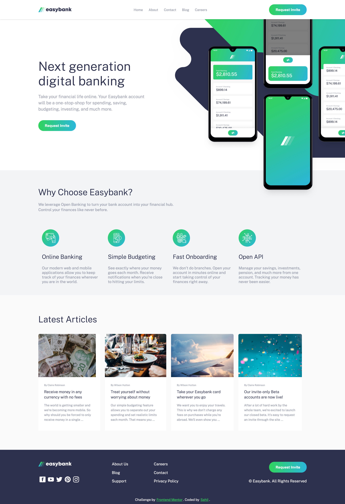

# Frontend Mentor - Easybank landing page solution

This is a solution to the [Easybank landing page challenge on Frontend Mentor](https://www.frontendmentor.io/challenges/easybank-landing-page-WaUhkoDN).

- Go Test Here: [Easybank-Landing-Page](https://easybank-beige.vercel.app/)


### Preview




### Built with
* [ReactJs](https://reactjs.org) - A JavaScript library for building user interfaces
* [SCSS](https://sass-lang.com) - CSS with superpowers
* [HTML](https://www.html.com/) - Standard markup language

## Getting Started

**1.** Fork [this](https://github.com/thesahindia/Easybank-Landing-Page) repository :fork_and_knife:

**2.** Clone your forked repository to your local system :busts_in_silhouette:
```sh
git clone https://github.com/<your-username>/Easybank-Landing-Page.git
```
Or Download and extract the zip file.

### Prerequisites

* A modern-web browser like Brave , Chrome , Firefox etc
* Node
* Computer..

### Running

1. Install NPM packages
```sh
npm run setup
```
2. Run 
```sh
npm run dev
```
3. Open your browser and go to http://127.0.0.1:3000 or https://localhost:3000


## Author

* **[Sahil](https://github.com/thesahindia)**

## License

This project is licensed under the MIT License - see the [LICENSE.md](https://github.com/thesahindia/Easybank-Landing-Page/blob/main/LICENSE) file for details
